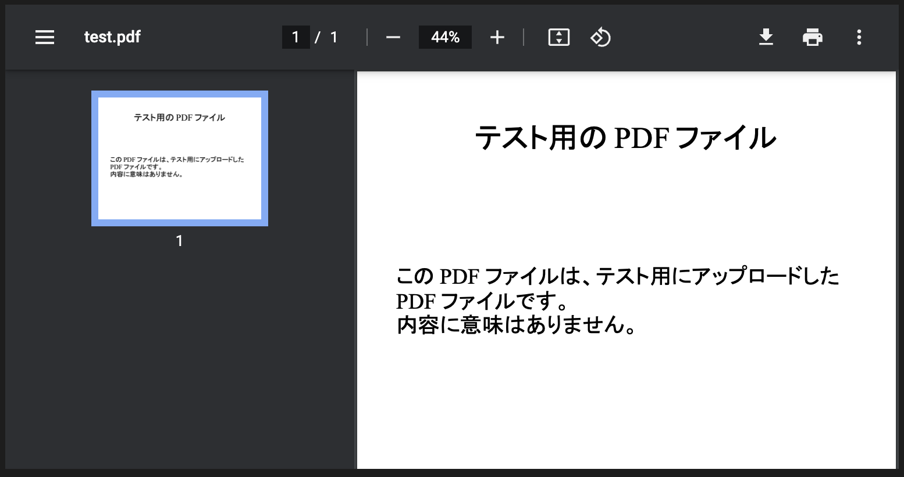
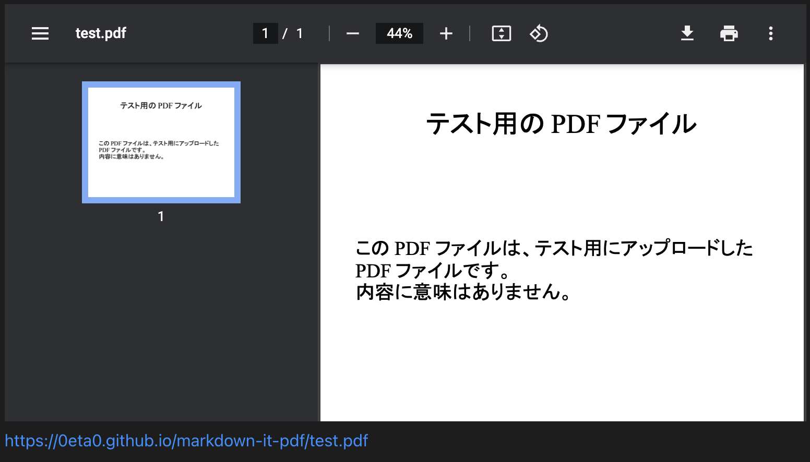

# markdown-it-pdf

PDF viewer for markdown-it

NOTE:  
THIS IS NOT PLUGIN TO CONVERT MARKDOWN TO PDF.


## Installation

```
npm install markdown-it-pdf
```


## Usage

```js
import markdownIt from "markdown-it";
import markdownItPdf from "markdown-it-pdf";
const md = new markdownIt("default", {
  html: true
});
md.use(markdownItPdf);
// You can also write like this.
// md.use(require(markdown-it-pdf));
const pdfUrl =
  "https://0eta0.github.io/markdown-it-pdf/test.pdf";

md.render(`@[pdf](${pdfUrl})`);
```

### Result on the chrome



### Options
```js
md.use(require(markdown-it-pdf), {
  showUrl: true
});
```

If you add option "showUrl", the URL link will attach after PDF viewer.

### Result on the chrome




## Development

### Test
```
npm test
```